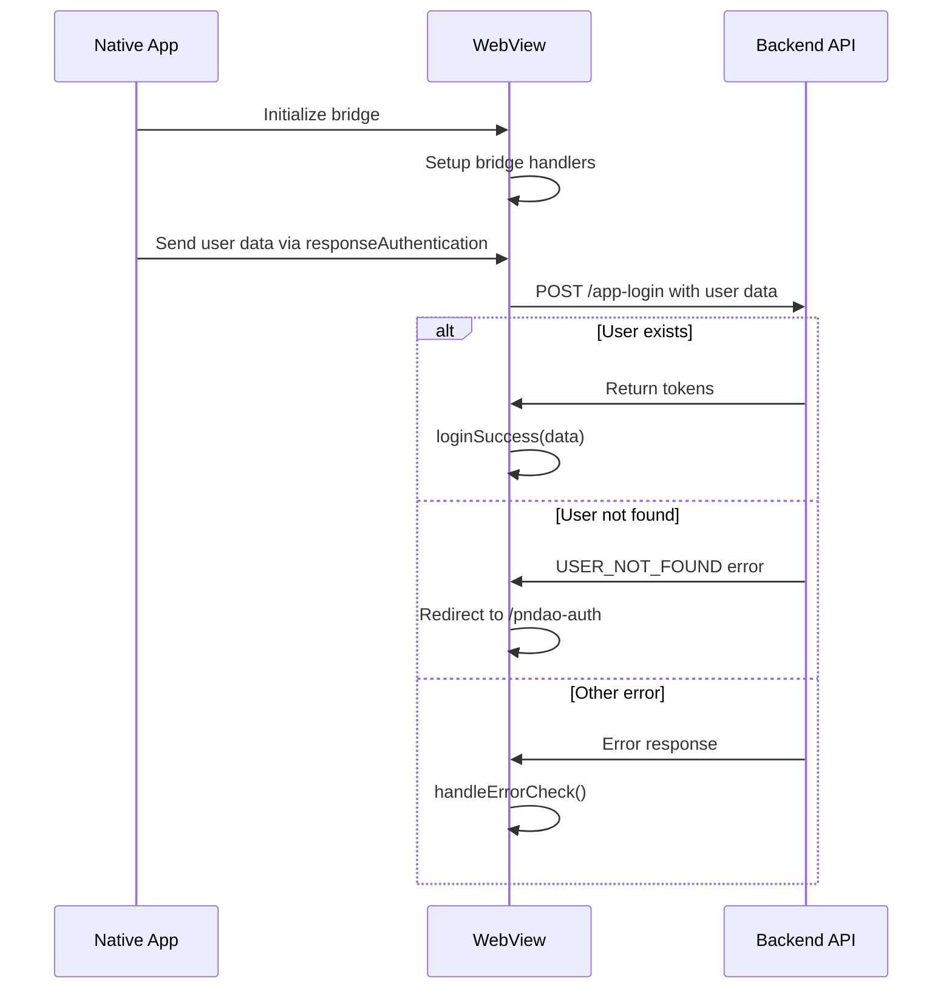

# WebView JavaScript Bridge Authentication

A comprehensive guide for implementing WebView JavaScript Bridge authentication in your PNDAO app.

## Overview

This system enables seamless communication between a native mobile app and a WebView, specifically for handling user authentication through a JavaScript bridge interface.

## Components

### 1. Bridge Setup Utility

The bridge utility establishes communication between the WebView and the native app.

#### File: `utils/bridge.ts`

```typescript
export const setupWebViewJavascriptBridge = (callback: any) => {
  if ((window as any).WebViewJavascriptBridge) {
    return callback((window as any).WebViewJavascriptBridge);
  }
  if ((window as any).WVJBCallbacks) {
    return (window as any).WVJBCallbacks.push(callback);
  }
  (window as any).WVJBCallbacks = [callback];
  let WVJBIframe = document.createElement("iframe");
  WVJBIframe.style.display = "none";
  WVJBIframe.src = "https://__bridge_loaded__";
  document.documentElement.appendChild(WVJBIframe);
  setTimeout(function () {
    document.documentElement.removeChild(WVJBIframe);
  }, 0);
};
```

### 2. Authentication Bridge Handler

The main authentication handler that processes user data from the native app.

#### Bridge Method: `responseAuthentication`

**Parameters:**

| Parameter | Type   | Required | Description           |
| --------- | ------ | -------- | --------------------- |
| uid       | int64  | ✅       | PNDAO app user ID     |
| username  | string | ✅       | PNDAO app username    |
| nickname  | string | ✅       | PNDAO app nickname    |
| avatar    | string | ❌       | PNDAO app user avatar |

#### Implementation Example

```typescript
setupWebViewJavascriptBridge(function (bridge: any) {
  bridge.init(function (message: any, responseCallback: any) {
    if (responseCallback) {
      responseCallback({ "Javascript Responds": "defaultHandler" });
    }
  });

  bridge.registerHandler(
    "responseAuthentication",
    async function (response: any) {
      const requestParams = {
        uid: response["uid"],
        username: response["username"],
        nickname: response["nickname"],
        avatar: response["avatar"],
        refferalUid: response["referrer"],
      };

      // Attempt login
      isLoading.value = true;
      const { code, data, message, error } = await appLogin(requestParams);
      isLoading.value = false;

      if (code === 0) {
        loginSuccess(data);
        return;
      }

      // Handle user not found - redirect to registration
      if (message == "USER_NOT_FOUND" && error == "USER_NOT_FOUND") {
        router.push({
          path: "/pndao-auth",
          query: requestParams,
        });
        return;
      }

      handleErrorCheck(
        message,
        t(`api.auth.${error}`),
        te(`api.auth.${error}`)
      );
    }
  );
});
```

### 3. Login API Endpoint

The backend API endpoint that processes authentication requests.

#### Endpoint: `/app-login`

**Method:** `POST`  
**Content-Type:** `application/json`

#### Request Body

| Parameter | Type   | Required | Description           |
| --------- | ------ | -------- | --------------------- |
| uid       | int64  | ✅       | PNDAO app user ID     |
| username  | string | ✅       | PNDAO app username    |
| nickname  | string | ✅       | PNDAO app nickname    |
| avatar    | string | ❌       | PNDAO app user avatar |

#### Response Format

```json
{
  "code": 0,
  "message": "Success",
  "data": {
    "access_token": "bearer_token_string",
    "expires_in": 3600,
    "refresh_token": "refresh_token_string"
  }
}
```

#### Response Fields

| Field           | Type   | Description                   |
| --------------- | ------ | ----------------------------- |
| code            | int32  | Response status code          |
| message         | string | Response message              |
| data            | object | Authentication data           |
| └─access_token  | string | Bearer token for API requests |
| └─expires_in    | int64  | Token expiration time         |
| └─refresh_token | string | Token for refreshing access   |

### 4. Register API Endpoint

The backend API endpoint that processes when user not found.

#### Endpoint: `/app-register`

**Method:** `POST`  
**Content-Type:** `application/json`

#### Request Body

| Parameter    | Type   | Required | Description           |
| ------------ | ------ | -------- | --------------------- |
| uid          | int64  | ✅       | PNDAO app user ID     |
| username     | string | ✅       | PNDAO app username    |
| nickname     | string | ✅       | PNDAO app nickname    |
| avatar       | string | ❌       | PNDAO app user avatar |
| account      | string | ✅       | dapp account          |
| password     | string | ✅       | dapp password         |
| refferalCode | string | ✅       | dapp invite code      |

#### Response Format

```json
{
  "code": 0,
  "message": "Success",
  "data": {
    "access_token": "bearer_token_string",
    "expires_in": 3600,
    "refresh_token": "refresh_token_string"
  }
}
```

#### Response Fields

| Field           | Type   | Description                   |
| --------------- | ------ | ----------------------------- |
| code            | int32  | Response status code          |
| message         | string | Response message              |
| data            | object | Authentication data           |
| └─access_token  | string | Bearer token for API requests |
| └─expires_in    | int64  | Token expiration time         |
| └─refresh_token | string | Token for refreshing access   |

### 5. Binding API Endpoint

The backend API endpoint that processes when dapp account exist.

#### Endpoint: `/app-binding`

**Method:** `POST`  
**Content-Type:** `application/json`

#### Request Body

| Parameter | Type   | Required | Description           |
| --------- | ------ | -------- | --------------------- |
| uid       | int64  | ✅       | PNDAO app user ID     |
| username  | string | ✅       | PNDAO app username    |
| nickname  | string | ✅       | PNDAO app nickname    |
| avatar    | string | ❌       | PNDAO app user avatar |
| account   | string | ✅       | dapp account          |
| password  | string | ✅       | dapp password         |

#### Response Format

```json
{
  "code": 0,
  "message": "Success",
  "data": {
    "access_token": "bearer_token_string",
    "expires_in": 3600,
    "refresh_token": "refresh_token_string"
  }
}
```

#### Response Fields

| Field           | Type   | Description                   |
| --------------- | ------ | ----------------------------- |
| code            | int32  | Response status code          |
| message         | string | Response message              |
| data            | object | Authentication data           |
| └─access_token  | string | Bearer token for API requests |
| └─expires_in    | int64  | Token expiration time         |
| └─refresh_token | string | Token for refreshing access   |

### 6. PNDAO Customer Service Bridge

Customer service bridge for PNDAO app communication.

#### Bridge Method: `contactCustomService`

This bridge method allows the WebView to initiate customer service contact through the native app.

#### Parameters

| Parameter  | Type  | Required | Description              |
| ---------- | ----- | -------- | ------------------------ |
| uid        | int64 | ✅       | dapp user ID             |
| contact_id | int64 | ✅       | PNDAO Service account ID |

#### Implementation Example

```typescript
// Contact customer service through bridge
const contactService = (serviceAccount: any) => {
  const params = {
    uid: Number(userStore.uid),
    contact_id: Number(serviceAccount.value),
  };

  (window as any).WebViewJavascriptBridge.callHandler(
    "contactCustomService",
    JSON.stringify(params),
    function (responseData: any) {
      // Handle response from native app
      console.log("Customer service response:", responseData);
    }
  );
};
```

## 7. PNDAO Dapp Pay Bridge

Pay function in PNDAO app.

### Bridge Method: `payDapp`

#### Parameters

| Parameter             | Type                       | Required | Description                       |
| --------------------- | -------------------------- | -------- | --------------------------------- |
| order_id              | string                     | ✅       | Pay order id                      |
| seller_wallet_address | string                     | ✅       | From address in wallet            |
| buyer_wallet_address  | string                     | ✅       | To address in wallet              |
| symbol                | string                     | ✅       | Token symbol (only USDK)          |
| amount                | string &#124;&#124; number | ✅       | Transfer amount                   |
| price                 | string                     | ✅       | Token quantity (amount \* 100000) |

#### Implementation Example

```typescript
(window as any).WebViewJavascriptBridge.callHandler(
  "payDapp",
  {
    order_id: snowflake.generate(),
    seller_wallet_address: fromAddress,
    buyer_wallet_address: toAddress,
    symbol: "USDK",
    amount: amount,
    price: amount * 100000,
  },
  function (responseData: any) {}
);
```

## 8. PNDAO Dapp Pay Response Bridge

Pay response function in PNDAO app.

### Bridge Method: `responsePayDapp`

#### Response Parameters

| Parameter   | Type                       | Description            |
| ----------- | -------------------------- | ---------------------- |
| orderId     | string                     | Pay order id           |
| txHash      | string                     | Transaction hash       |
| fromAddress | string                     | From address in wallet |
| toAddress   | string                     | To address in wallet   |
| amount      | string &#124;&#124; number | Transfer amount        |

#### Implementation Example

```typescript
setupWebViewJavascriptBridge(function (bridge: any) {
  bridge.init(function (message: any, responseCallback: any) {
    if (responseCallback) {
      responseCallback({ "Javascript Responds": "defaultHandler" });
    }
  });

  // register handler
  bridge.registerHandler("responsePayDapp", async function (response: any) {
    console.log("responsePayDapp completed:", response);
    const { code, error, data, message } = await rechargeAdd({
      chain: protocol.value.type,
      address: protocol.value.account,
      amount: multiply(money.value),
      currency: "USDT",
      originalAmount: multiply(money.value),
      isCertified: protocol.value.isCertified,
      payType: 1,
      orderId: response["orderId"],
      txHash: response["txHash"],
      fromAddress: response["fromAddress"],
      toAddress: response["toAddress"],
      txAmount: response["amount"],
    });

    if (!code) {
      router.push({
        path: "/center/rechargeNow",
        query: {
          id: data.id,
          chainAddress: protocol.value.account,
          chain: protocol.value.type,
          amount: money.value,
        },
      });
      return;
    }

    handleErrorCheck(
      message,
      t(`front.api.center.${error}`),
      te(`front.api.center.${error}`)
    );
  });
});
```

## Authentication Flow



## Implementation Steps

### 1. Setup Bridge Communication

1. Import the bridge utility in your WebView component
2. Initialize the bridge with appropriate handlers
3. Register the `responseAuthentication` handler

### 2. Handle Authentication Response

1. Extract user data from the bridge response
2. Call the `/app-login` API endpoint
3. Handle success, user not found, and error cases appropriately

### 3. Error Handling

The system handles three main scenarios:

- **Success (code: 0)**: User authenticated successfully
- **User Not Found**: Redirect to registration/binding page
- **Other Errors**: Display appropriate error messages

## Error Codes

| Code   | Message        | Description                            |
| ------ | -------------- | -------------------------------------- |
| 0      | Success        | Authentication successful              |
| -1     | USER_NOT_FOUND | User needs to register or bind account |
| Others | Various        | Check API documentation for details    |

## Dependencies

- TypeScript support
- Vue Router (for navigation)
- Internationalization library (for error messages)
- HTTP client for API calls

## Usage Notes

1. Ensure the WebView has JavaScript enabled
2. The bridge URL `https://__bridge_loaded__` is a special protocol for bridge initialization
3. Handle loading states appropriately during authentication
4. Implement proper error handling for network failures
5. Consider implementing token refresh mechanisms

## Security Considerations

- Validate all incoming bridge data
- Implement proper token storage (secure storage recommended)
- Handle token expiration gracefully
- Use HTTPS for all API communications
- Implement proper logout functionality to clear stored tokens
